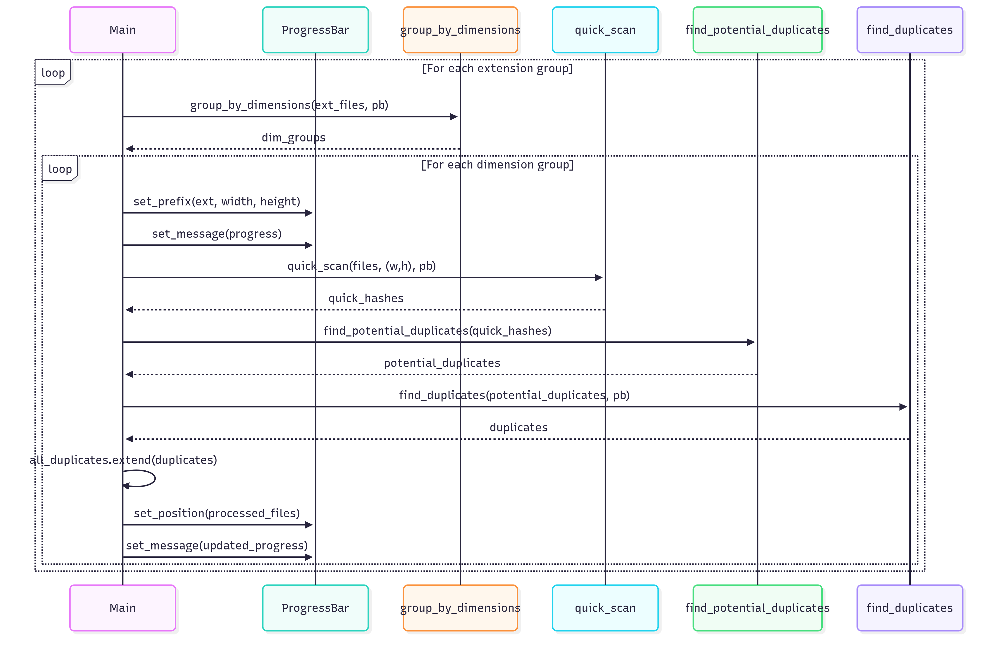

# Duplicate Image Finder

A high-performance command-line tool to find and manage duplicate images in your directories, written in Rust.

## Features

- 🚀 Blazing fast scanning using multi-threading with Rayon
- 🔍 Two-phase detection (quick hash + deep comparison)
- 📊 Detailed file statistics including extension-based grouping
- 🖼️ Supports multiple image formats (JPEG, PNG, GIF, BMP, TIFF, HEIC, HEIF, WebP)
- 📈 Progress tracking with `indicatif`
- 🔢 Batch processing for memory efficiency
- 📋 Clean, organized output with file type breakdown
- 🔍 Smart filtering by image dimensions before comparison
- 📝 Multiple output formats (Plain text and JSON)

## Installation

### Prerequisites
- Rust and Cargo (Rust's package manager) installed
- System dependencies for HEIC/HEIF support:
  - Windows: [vcpkg](https://vcpkg.io/) with `libheif`
  - macOS: `brew install libheif`
  - Linux (Debian/Ubuntu): `sudo apt-get install libheif-dev`

For detailed HEIC/HEIF testing instructions, see [HEIC_HEIF_TESTING.md](HEIC_HEIF_TESTING.md).

### Building from Source

```bash
# Clone the repository
git clone https://github.com/yourusername/dedupe_rust.git
cd dedupe_rust

# Build in release mode (recommended for performance)
cargo build --release

# The binary will be available at ./target/release/dedupe_rust
```

## Usage

Development run the program with the following command:

```bash
cargo run --bin dedupe_rust --release -- -d c:\MyFolder\To\Scan
```

```bash
# Basic usage (scans current directory)
./dedupe_rust

# Scan a specific directory
./dedupe_rust -d /path/to/images
```


### Command Line Options

```
USAGE:
    dedupe_rust [OPTIONS] --directory <DIRECTORY>

OPTIONS:
    -d, --directory <DIRECTORY>    Directory to scan (default: current directory)
    -b, --batch-size <BATCH_SIZE>  Number of images to process in each batch (default: 1000)
    -h, --help                     Print help
    -V, --version                  Print version
```

### Output Formats

The tool supports two output formats:

1. **Plain Text (Default)**
   - Human-readable format with grouped duplicates
   - Shows file paths and image dimensions
   - Example:
     ```
     ✨ Found 2 groups of duplicates in 1.23s
     
     Group 1 (3 files, 800x600):
       /path/to/image1.jpg
       /path/to/image2.jpg
       /path/to/image3.jpg
     
     Group 2 (2 files, 1920x1080):
       /path/to/image4.jpg
       /path/to/image5.jpg
     ```

2. **JSON**
   - Machine-readable format for programmatic use
   - Includes all information in a structured format
   - Example:
     ```json
     {
       "groups": [
         {
           "files": [
             "/path/to/image1.jpg",
             "/path/to/image2.jpg",
             "/path/to/image3.jpg"
           ],
           "dimensions": "800x600"
         },
         {
           "files": [
             "/path/to/image4.jpg",
             "/path/to/image5.jpg"
           ],
           "dimensions": "1920x1080"
         }
       ],
       "total_groups": 2,
       "execution_time": "00:00:01.23"
     }
     ```

When you run the tool, it will prompt you to select your preferred output format:
```
Select output format:
1) Plain text
2) JSON
Enter your choice (1-2): 
```


### Sequential Diagram


